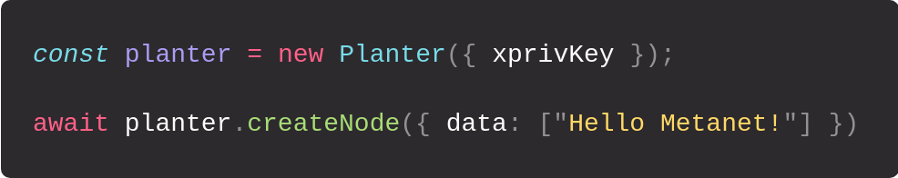

# planter

> Create Metanet Nodes on Bitcoin SV

_planter_ is a simple library for fetching and creating Metanet nodes on the **Bitcoin SV blockchain**.



# Setup

```bash
npm i planter
```

Include _planter_ in your project

```js
import { Planter } from "planter";
```

```html
<script src="https://unpkg.com/bsv/bsv.min.js"></script>
<script src="https://unpkg.com/planter/dist/planter.min.js"></script>
```

Be sure to include the [bsv library](https://docs.moneybutton.com/docs/bsv-overview.html) as well when using the web version.

# Usage

```js
const planter = new Planter();
```

This will generate a wallet for you which will be used to derive node addresses and sign transactions.
You can use an existing wallet by passing an [extended private Key](https://docs.moneybutton.com/docs/bsv-hd-private-key.html).

```js
const planter = new Planter(
  "xprv9s21ZrQH143K3eQCpBqZiuLgNSFPAfkqimfqyDxJ6HAaVUqWWJ4vz7eZdhgkR66jD1a2BtQEXbYjjbfVXWhxz7g4sNujBt6cnAoJrdfLkHh"
);
```

Funding can be provided by depositing BSV to the associated address.

```js
planter.fundingAddress;
```

## Creating nodes

```js
await planter.createNode(options);
```

These additional options can be passed:

- `data: string[]` - Array of data to include in `OP_RETURN`
- `parentTxID: string` - For creating child nodes.
- `parentKeyPath: string` - Can be passed when `parentTxID` is also passed to override `keyPath` of parent node.
- `keyPath: string` - For setting the keypath manually. Default is `m/0`.
- `safe: boolean` - Use OP_FALSE for scripts. Default is `true`.
- `includeKeyPath: boolean` - Write `keyPath` information to `OP_RETURN`. Defaults to `true`. Can be deactivated to manage keyPaths locally.

Successfully creating nodes returns an object that contains the new nodes `address`, `id`, `txid` and used `keyPath`.

## Traversing the Metanet

```js
await planter.findAllNodes();
```

This will query all nodes owned by the `Planter` instance.

_planter_ is built on top of _[TreeHugger](https://treehugger.bitpaste.app/)_ and exposes its API for querying and traversing metanet nodes. See TreeHuggers [Github page](https://github.com/libitx/tree-hugger) for details.

_planter_ also exposes TreeHugger directly for general node querying.

```js
import { TreeHugger } from "planter";

const node = await TreeHugger.findNodeByTxid(txid);
```

### Queries

```js
await planter.findSingleNode(query);
await planter.findAllNodes(query);

await planter.findNodeById(id);
await planter.findNodeByTxid(txid);
await planter.findNodesByAddress(address);
await planter.findNodesByParentId(id);
await planter.findNodeAndDescendants(id);
```

### Relative traversal

```js
await node.root();
await node.parent();
await node.ancestors();
await node.siblings();
await node.children();
await node.descendants();
await node.selfAndAncestors();
await node.selfAndSiblings();
await node.selfAndChildren();
await node.selfAndDescendants();
```

## Creating child nodes and updates

```js
await node.createChild(planter, options);
await node.createUpdate(planter, options);
```

The same options as before are accepted. Additionally, the `Planter` instance that should be used has to be passed.

## Node properties

```js
node.keyPath; // extracts keyPath out of OP_RETURN if it exists. Rerturns undefined otherwise

// Properties inherited from Treehugger
node.id; // Metanet node id
node.txid; // Transaction id
node.address; // Metanet node address

node.isRoot;
node.isChild;
node.isLeaf;

node.tx; // Planaria tx object

node.inputs; // Shortcut to node.tx.in
node.outputs; // Shortcut to node.tx.out
node.opReturn; // Shortcut to the OP_RETURN output object
```

## Under the hood

_planter_ randomly generates the keypaths used to derive node addresses to avoid accidental reuse and writes them onto the `OP_RETURN` data right after the metanet protocol keywords.
